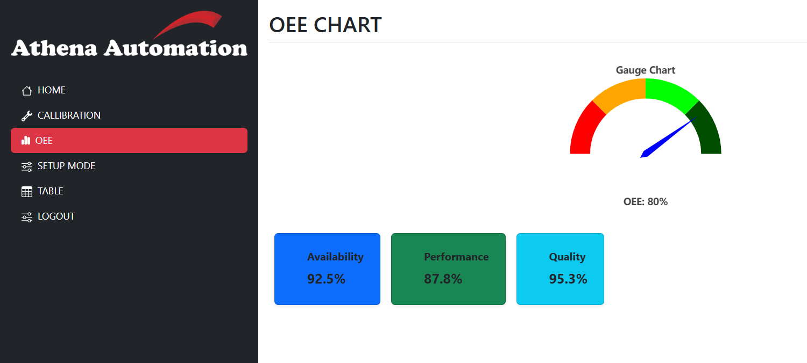
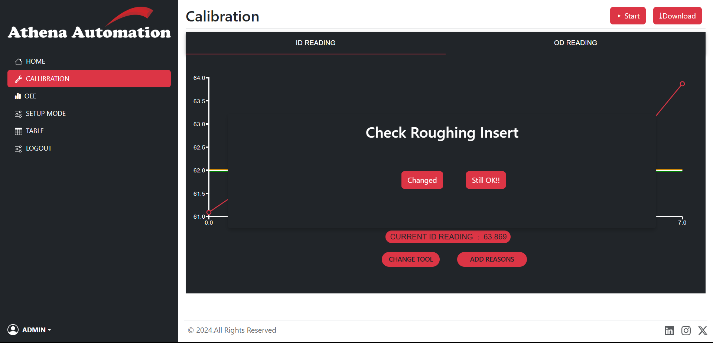
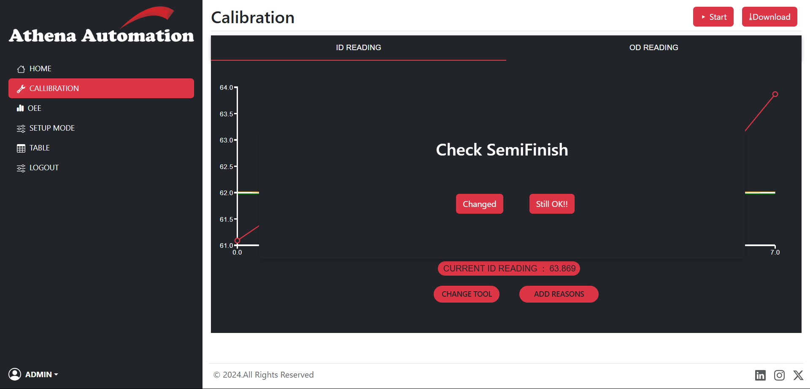
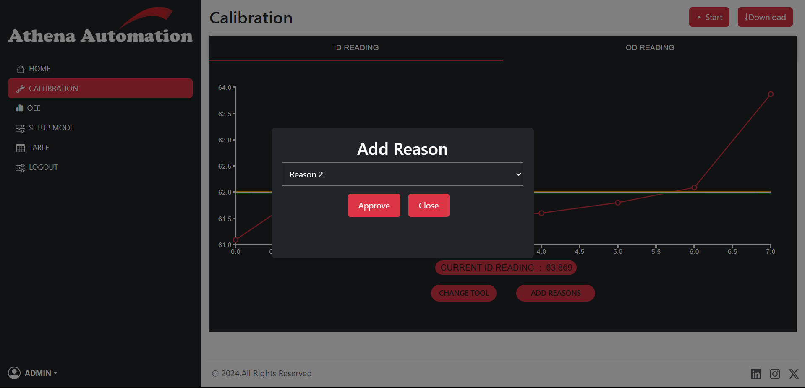
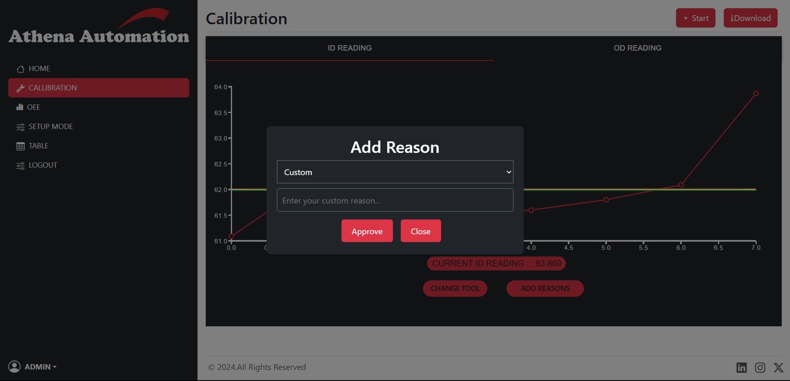

# Athena Automation Dashboard

Welcome to the Athena Automation Dashboard project. This is a web application built with React.

## Project Overview

Athena Automation Dashboard is a React-based web application designed to provide an interface for managing various automation tasks.

### Prerequisites

Make sure you have the following installed on your machine:

- [Node.js](https://nodejs.org/) (v14 or later)
- [npm](https://www.npmjs.com/) (v6 or later)

### Installation

1. Clone the repository:

   ```bash
   git clone https://github.com/yourusername/athena-automation-dashboard.git
   ```

2. Navigate to project directory:

   cd athena-automation-dashboard

## Configuring Database

To configure the database connection, you need to create a `.env` file in the root directory of the
express project.

Here's an example of how the `.env` file should look like:

```
      DB_HOST=<db_url_here>
      DB_USER=<db_username>
      DB_PASSWORD=<db_password>
      DB_PORT=<db_port>
      DB_NAME=<db_name>
```

Once the `.env` file is configured, you need to create the required table(s) using the provided schema.

### Database Structure

1. Table- Fields

| Column Name  | Data Type     | Description                                               |
| ------------ | ------------- | --------------------------------------------------------- |
| `field_name` | `VARCHAR(50)` | The name of the field (e.g., status or measurement type). |
| `value`      | `VARCHAR(50)` | The value associated with the field name.                 |

Possible field names include: HIGH, LOW, ZERO, READINGS, NEW_ENTRY, MEDIUM, SETUP, CALIBRATION, START, INSERT_INDEXING, TOOL_BROKEN, BP.

```
CREATE TABLE Fields (
    field_name VARCHAR(50),
    value VARCHAR(50)
);
```

2. Table: Readings

| Column Name  | Data Type                           | Description                         |
| ------------ | ----------------------------------- | ----------------------------------- |
| `ID`         | `INT` (AUTO_INCREMENT, PRIMARY KEY) | Unique identifier for each reading. |
| `ID_Reading` | `VARCHAR(50)`                       | Identifier for the reading.         |
| `OD_Reading` | `VARCHAR(50)`                       | Corresponding output reading.       |

```
CREATE TABLE Readings (
    ID INT NOT NULL AUTO_INCREMENT,
    ID_Reading VARCHAR(50),
    OD_Reading VARCHAR(50),
    PRIMARY KEY (ID)
);
```

3. Table: Df

| Column Name | Data Type                           | Description                          |
| ----------- | ----------------------------------- | ------------------------------------ |
| `ID`        | `INT` (AUTO_INCREMENT, PRIMARY KEY) | Unique identifier for each entry.    |
| `UoM`       | `VARCHAR(20)`                       | Unit of Measure.                     |
| `Feature`   | `VARCHAR(20)`                       | Feature name.                        |
| `USL`       | `VARCHAR(20)`                       | Upper Specification Limit.           |
| `LSL`       | `VARCHAR(20)`                       | Lower Specification Limit.           |
| `SVfCL`     | `VARCHAR(20)`                       | Statistical Value for Control Limit. |
| `Turret`    | `VARCHAR(20)`                       | Associated turret.                   |
| `XZ`        | `VARCHAR(20)`                       | Measurement details.                 |
| `Calhigh`   | `VARCHAR(20)`                       | Calibration high value.              |
| `Callow`    | `VARCHAR(20)`                       | Calibration low value.               |
| `Bias`      | `VARCHAR(20)`                       | Measurement bias.                    |
| `Max`       | `VARCHAR(20)`                       | Maximum value.                       |
| `DependsOn` | `VARCHAR(20)`                       | Dependencies for the feature.        |
| `WVfI`      | `VARCHAR(20)`                       | Value for Indicator.                 |
| `UIW`       | `VARCHAR(20)`                       | User Interface Widget.               |

```
CREATE TABLE Df (
    ID INT AUTO_INCREMENT,
    UoM VARCHAR(20),
    Feature VARCHAR(20),
    USL VARCHAR(20),
    LSL VARCHAR(20),
    SVfCL VARCHAR(20),
    Turret VARCHAR(20),
    XZ VARCHAR(20),
    Calhigh VARCHAR(20),
    Callow VARCHAR(20),
    Bias VARCHAR(20),
    Max VARCHAR(20),
    DependsOn VARCHAR(20),
    WVfI VARCHAR(20),
    UIW VARCHAR(20),
    PRIMARY KEY (ID)
);
```
4. Reason Table:
   
| Column Name  | Data Type                           | Description                         |
| ------------ | ----------------------------------- | ----------------------------------- |
| `reason`     | `varchar(50)`                       | Reason adde when tool changes.      |
| `updated_at` | `BIGINT(20)`                        | Time at which reason added.         |
| `ID_Reading` | `VARCHAR(50)`                       | Store the current ID_Reading of job.|

```
CREATE TABLE Reason (
    reason VARCHAR(50) NULL,
    updated_at BIGINT NULL,
    ID_Reading VARCHAR(20) NULL
);
```

5. User Login Table:
   
| Column Name  | Data Type                           | Description                         |
| ------------ | ----------------------------------- | ----------------------------------- |
| ` id   `     | `INT AUTO_INCREMENT PRIMARY KEY`    | Reason adde when tool changes.      |
| `username  ` | `VARCHAR(50)`                       | Time at which reason added.         |
| `logged_in_at` | `BIGINT NULL`                     | Store the current ID_Reading of job.|
| `logged_out_at` | `BIGINT NULL`                    | Store the current ID_Reading of job.|

```
CREATE TABLE user_logins (
    id INT NOT NULL AUTO_INCREMENT PRIMARY KEY,
    username VARCHAR(50) NOT NULL,
    logged_in_at BIGINT NULL,
    logged_out_at BIGINT NULL
);

```

6. Triggers to set

```
CREATE TRIGGER check_before_insert
BEFORE INSERT ON Readings
FOR EACH ROW
BEGIN
IF (SELECT value FROM Fields WHERE field_name = 'SETUP' LIMIT 1) = 'True' THEN
      SIGNAL SQLSTATE '45000'
      SET MESSAGE_TEXT = 'Insert not allowed because condition in Fields is not True.';
END IF;
END;
```

```
CREATE TRIGGER after_reading_insert AFTER INSERT
ON Readings
FOR EACH ROW
UPDATE Fields SET value = 'True' WHERE field_name = 'NEW_ENTRY';
```

## Getting Started

STEP 1 : Configure the database

STEP 2 : run the express server

```bash
cd ./express-app
npm install
node app.js
```

STEP 3 : run the react develeopment sserver

```bash
cd .././react-app
npm install
npm run dev
```

Open [http://localhost:5173](http://localhost:5173) with your browser to see the result.

## Page description

### 0.Login Page :

##### [ Username - admin , Password - admin ]


### 1.Calibration Mode:

The home page is the Calibration mode. This page is used to set the initial offset of the sensor. The user can select the units of measurement and the material type. The user can also select the type of calibration either by entering the offset value or by using the auto calibration feature. The user is also informed of the current state of the device, whether it is in calibration mode or not.

<table>
  <tr>
    <td style="text-align: center; vertical-align: top;">
      
      <p style="margin: auto;text-align: center;" align="center">ID READINGS</p>
    </td>
    <td style="text-align: center; vertical-align: top;">
      
      <p style="margin: auto;text-align: center;" align="center">OD READINGS</p>
    </td>
  </tr>
</table>

### 2.SetUp Mode:

The setup mode is used to set the upper and lower specification limits for each feature. The user can select the units of measurement and the material type. The user can also select the type of setup either by entering the offset value or by using the auto setup feature.

<table>
  <tr>
    <td style="text-align: center; vertical-align: top;">
      
      <p style="margin: auto;text-align: center;" align="center">SetUP Mode (Zero Calibration)</p>
    </td>
    <td style="text-align: center; vertical-align: top;">
      
      <p style="margin: auto;text-align: center;" align="center">SetUP Mode (Success)</p>
    </td>
  </tr>
</table>

### 3.Table:

The table page shows the data from the database in a table format. The user can select which table to view and sort the data by any column. The user can also filter the data by any column. The user can also add new data to the table by clicking the "Add new data" button. The user can edit and delete data by clicking the "Edit" and "Delete" buttons respectively.


<table>
  <tr>
    <td style="text-align: center; vertical-align: top;">
      
      <p style="margin: auto;text-align: center;" align="center">Table</p>
    </td>
    <td style="text-align: center; vertical-align: top;">
      
      <p style="margin: auto;text-align: center;" align="center">Table Add</p>
    </td>
  </tr>
   <tr>
    <td style="text-align: center; vertical-align: top;">
      
      <p style="margin: auto;text-align: center;" align="center">Table Delete</p>
    </td>
    <td style="text-align: center; vertical-align: top;">
      
      <p style="margin: auto;text-align: center;" align="center">Table Update</p>
    </td>
  </tr>
</table>


### 4.OEE Chart:

The OEE (Overall Equipment Effectiveness) Chart Page visually represents key performance indicators of a manufacturing or production system. It includes:
Features:
   1. Gauge Chart for OEE
   2. Displays the Overall Equipment Effectiveness (OEE) percentage.
   3. Uses a color-coded dial to indicate performance levels (Red: Poor, Orange: Average, Green: Good).
   4. The needle points to the current OEE value (e.g., 80%).

Key Performance Metrics
   1. Availability: Measures the actual running time vs. planned production time (92.5%).
   2. Performance: Evaluates production speed relative to the ideal speed (87.8%).
   3. Quality: Represents the percentage of defect-free products (95.3%).
   4. Each metric is displayed in a colored card for better visualization.

Purpose:
   1. Helps monitor production efficiency in real-time.
   2. Identifies areas of improvement by analyzing availability, performance, and quality.
   3. Provides a quick overview of machine productivity using an intuitive graphical representation.



### 4.Change Tool Popups:

1. The Insert Indexing Pop-up Check ensures that the cutting tool insert is correctly positioned and indexed before machining begins, which is crucial for maintaining precision and consistency in CNC machining. 
   It helps in tool alignment, optimizes tool life by ensuring even wear, enhances process efficiency by minimizing manual intervention, and reduces defective parts by preventing machining errors.

2. The Roughing Insert Pop-up Check verifies the condition and placement of the roughing insert, which is responsible for the initial material removal. This check prevents tool breakage by detecting worn-out or 
   misaligned inserts, improves surface finish by ensuring uniform material removal, increases production speed by optimizing cutting performance, and reduces material waste by preventing defective roughing 
   passes.

3. The Semi-Finish Pop-up Check assesses the condition of the semi-finishing insert before the final finishing pass, ensuring a smooth transition from roughing to finishing operations. It maintains dimensional 
   accuracy by detecting insert wear or improper placement, reduces machine downtime by preventing tool-related errors, and improves surface quality for better finishing results. These pop-up checks are 
   essential for the auto-correction system in CNC machining at Athena Automation, enabling real-time monitoring, higher machining precision, reduced defects, and increased productivity.

   <table>
  <tr>
    <td style="text-align: center; vertical-align: top;">
      
      <p style="margin: auto;text-align: center;" align="center">Check InsertIndexing</p>
    </td>
    <td style="text-align: center; vertical-align: top;">
      
      <p style="margin: auto;text-align: center;" align="center">Check Roughing Insert</p>
    </td>
  </tr>
   <tr>
    <td style="text-align: center; vertical-align: top;">
      
      <p style="margin: auto;text-align: center;" align="center">Check SemiFinish</p>
    </td>
  </tr>
</table>


### 5.Change Tool and Add Reason Concept:

1.The Add Reason feature allows users to document the rationale behind specific actions, ensuring traceability, accountability, and compliance in automation workflows. It helps in error prevention, decision- 
  making, and industry-standard audit practices, making it a crucial feature for quality control in CNC-based automation. 

2. The Change Tool feature enables users to switch tools efficiently within a CNC system, reducing downtime, human intervention, and ensuring precision in manufacturing. By automating tool changes and linking 
   them to specific reasons, it optimizes workflow and enhances cost efficiency.
   
3. The Custom Reason feature further allows users to provide detailed justifications when predefined reasons are insufficient, adding flexibility and adaptability to the system. This feature aids in data 
   analysis, regulatory compliance, and enhanced documentation, making it essential for improving machine behavior tracking and process optimization.

   Collectively, these functionalities strengthen automation,logging, and efficiency, aligning with industry standards in manufacturing and automation.
   
   <table>
  <tr>
    <td style="text-align: center; vertical-align: top;">
      
      <p style="margin: auto;text-align: center;" align="center">Adding New Reason</p>
    </td>
    <td style="text-align: center; vertical-align: top;">
      
      <p style="margin: auto;text-align: center;" align="center">Changing Tool</p>
    </td>
  </tr>
   <tr>
    <td style="text-align: center; vertical-align: top;">
      
      <p style="margin: auto;text-align: center;" align="center">Adding Custom Reason</p>
    </td>
  </tr>
</table>
   

